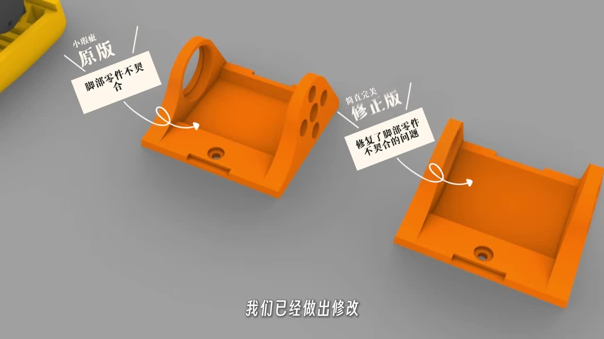
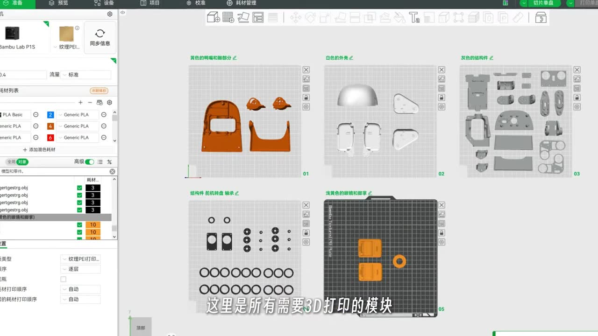
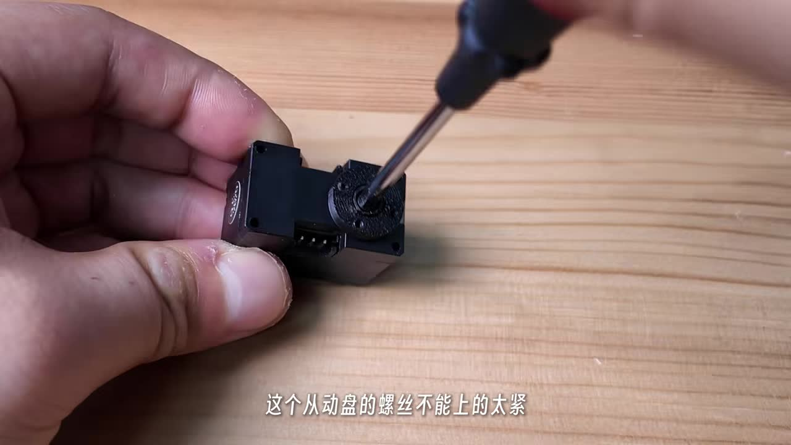
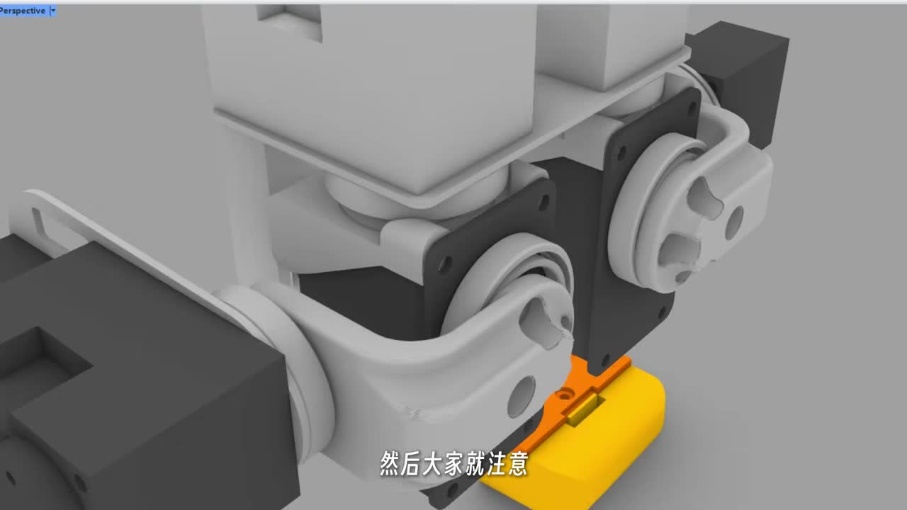
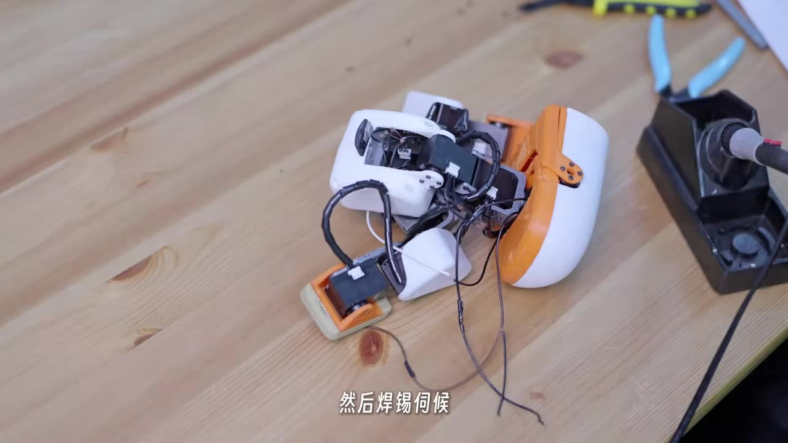
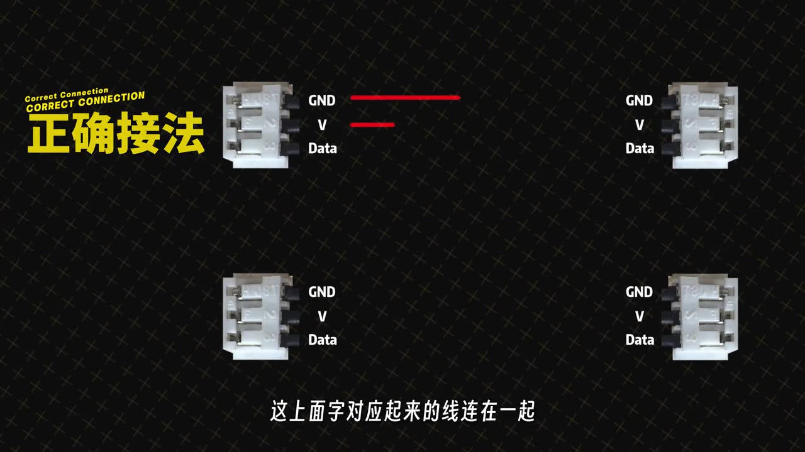
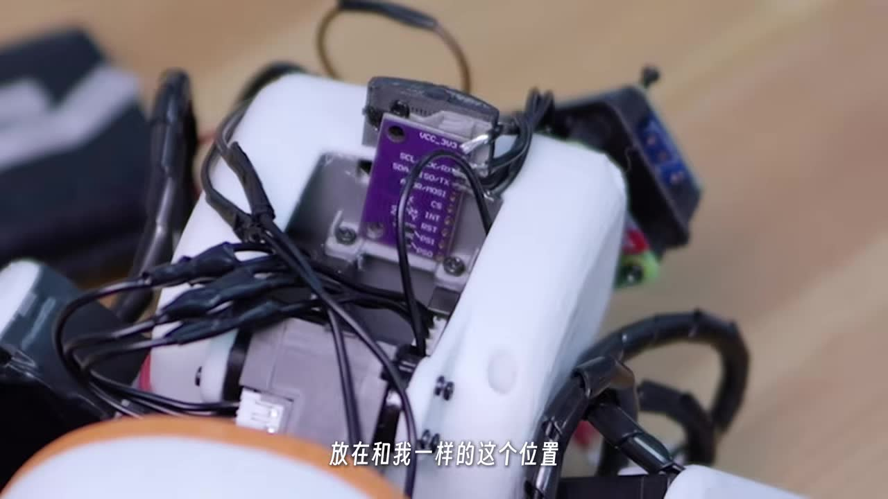

# 视频截图素材清单

本目录存放从 [Microduck biped build / Dynamixel XL330](https://www.youtube.com/watch?v=Vep8AjoCnEM)（AI-FanGe）中截取的画面，仅用于本文档的组装说明和物料参考。版权归原视频作者所有。

## 截图归属

- **视频来源：** https://www.youtube.com/watch?v=Vep8AjoCnEM
- **作者/频道：** AI-FanGe
- **GitHub：** https://github.com/AI-FanGe/Microduck-build-tutorial
- **用途：** 仅限本开源文档的教育/说明用途

## 文件清单

以下 JPG 已放入本目录，并在对应文档中以 Markdown 图片嵌入。

| 文件名 | 视频时间戳 | 内容 | 引用位置 |
| :--- | :--- | :--- | :--- |
| `01m44_xl330_wowrobo.jpg` | ~01:44 | XL330 舵机 WowRobo 淘宝采购截图 | BOM |
| `02m05_pi_zero.jpg` | ~02:05 | Pi Zero 2W 淘宝采购截图 | BOM |
| `02m06_openrb.jpg` | ~02:06 | OpenRB-150 淘宝采购截图 | BOM |
| `02m10_bno085.jpg` | ~02:10 | BNO085 IMU 淘宝采购截图 | BOM |
| `02m12_battery_6v4.jpg` | ~02:12 | 6.4V 1800mAh 磷酸铁锂电池 | BOM |
| `02m14_mini360.jpg` | ~02:14 | DC-DC Mini360 降压模块 | BOM |
| `02m18_switch.jpg` | ~02:18 | 电源开关采购截图 | BOM |
| `02m20_typec_micro.jpg` | ~02:20 | Type-C 转 Micro 转接头 | BOM |
| `02m25_screws.jpg` | ~02:25 | M2 自攻螺丝 OceanBest | BOM |
| `00m54_bambu_print_groups.jpg` | ~00:54 | Bambu Studio 打印分组（颜色分组） | 打印指南 |
| `03m07_bambu_studio.jpg` | ~03:07 | Bambu Studio 切片界面 | 打印指南 |
| `04m10_idler_joint.jpg` | ~04:10 | 惰轮关节螺丝不能过紧 | 组装指南 |
| `07m25_screw_length.jpg` | ~07:25 | 舵盘螺丝长度问题 | 组装指南 |
| `14m27_y_splice.jpg` | ~14:27 | Y 形分线线束焊接 | 接线指南 |
| `14m32_wiring_correct_incorrect.jpg` | ~14:32 | 正确/错误 3-pin 接法对比 | 接线指南 |
| `16m40_imu_mount.jpg` | ~16:40 | IMU 安装位置 | 组装指南 |
| `00m17_github.jpg` | ~00:17 | 上游 GitHub 仓库画面 | 可选参考 |
| `02m03_xl330_datasheet.jpg` | ~02:03 | XL330 规格/数据手册画面 | 可选参考 |

