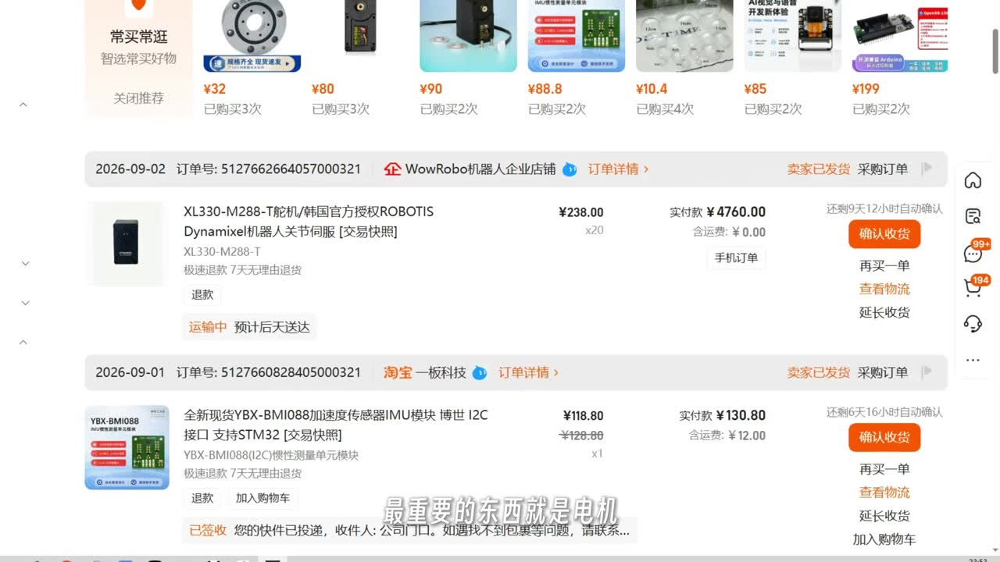
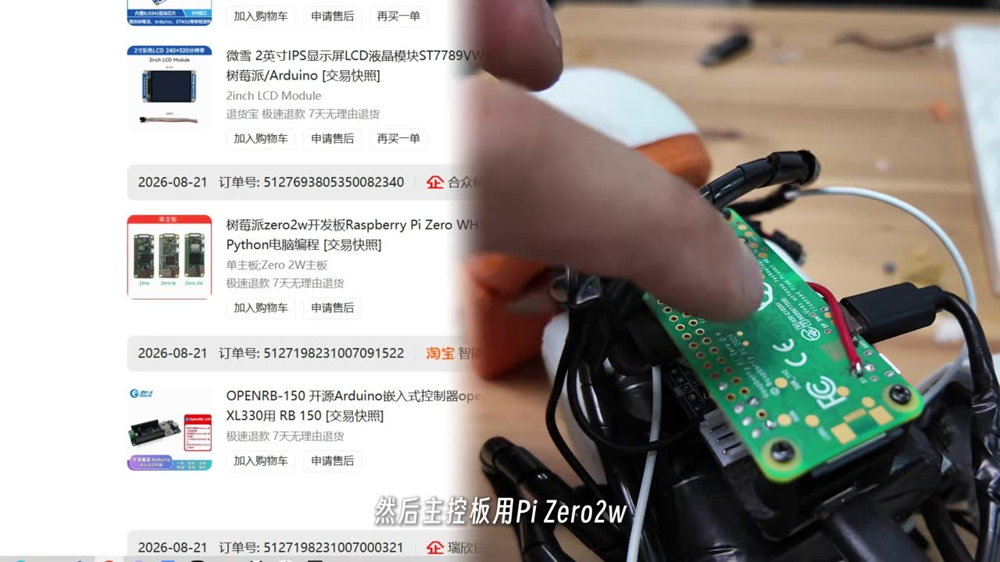
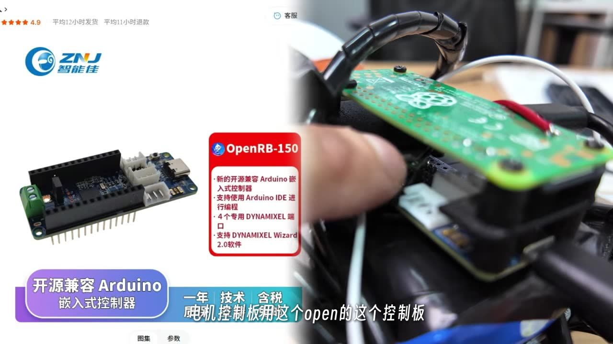
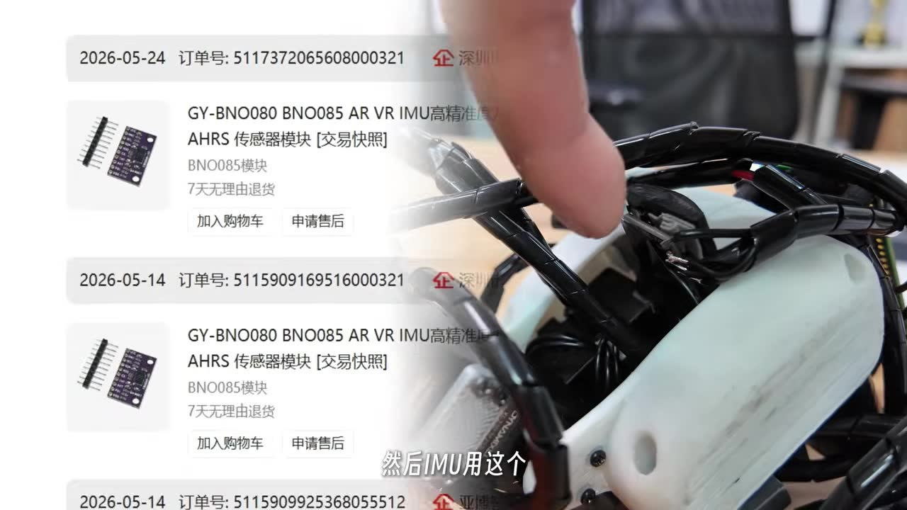
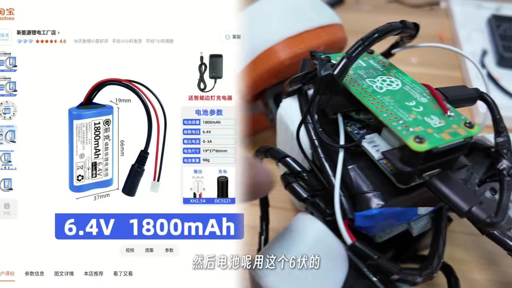
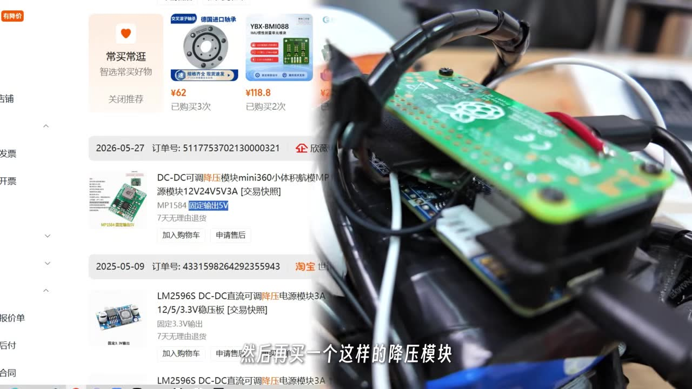
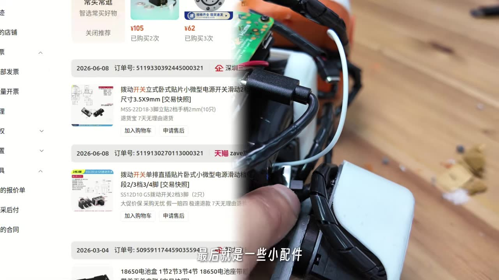
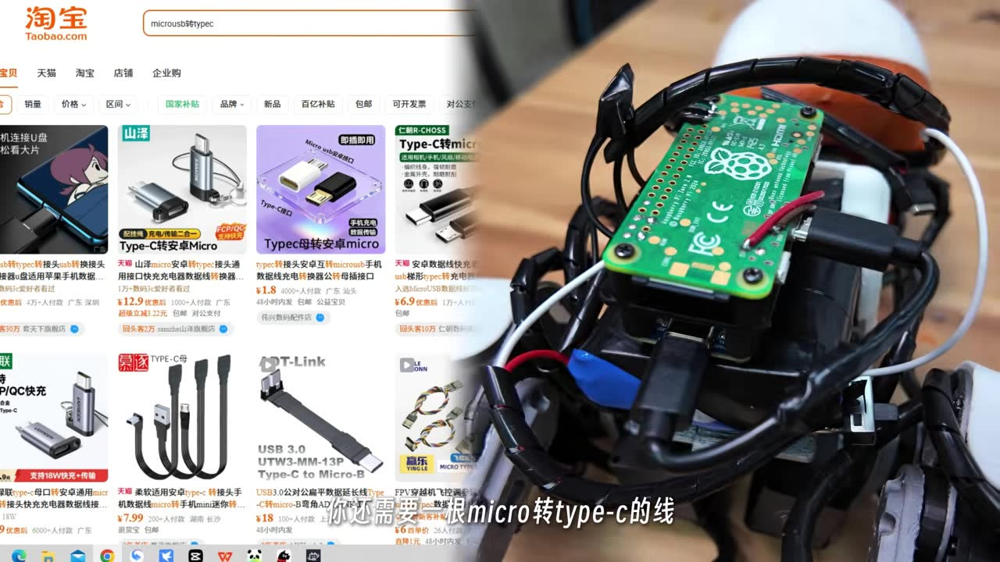

# 物料清单 (Bill of Materials)

组装一台 Microduck 所需的全部物料。价格因地区和渠道不同有所变化，链接指向代表性搜索结果，请按实际情况选择供应商。

> [!NOTE]
> 淘宝/京东链接为搜索链接，可能需要根据具体型号二次筛选。Amazon 链接适用于海外采购。

---

## 核心电子器件

| 物料 | 数量 | 说明 | 采购参考 |
| :--- | :---: | :--- | :--- |
| Raspberry Pi Zero 2 W | 1 | 主控制器，运行控制程序、蓝牙手柄、Wi-Fi 和 SSH。仅支持 2.4GHz Wi-Fi | [淘宝搜索](https://s.taobao.com/search?q=Raspberry+Pi+Zero+2+W) · [京东搜索](https://search.jd.com/Search?keyword=Raspberry+Pi+Zero+2W) · [Amazon](https://www.amazon.com/s?k=raspberry+pi+zero+2+w) |
| ROBOTIS OpenRB-150 | 1 | Dynamixel 舵机控制板，通过 USB 连接 Pi。代码自动查找 `/dev/serial/by-id/usb-ROBOTIS_OpenRB-150_*` | [淘宝搜索](https://s.taobao.com/search?q=ROBOTIS+OpenRB-150) · [ROBOTIS 官网](https://www.robotis.us/openrb-150/) |
| Dynamixel XL330-M288-T | 14 (建议多买 2 个备用) | 双腿 10 个 + 头颈 4 个。ID 15 可选嘴部舵机，当前行走策略不使用 | [淘宝搜索](https://s.taobao.com/search?q=Dynamixel+XL330-M288-T) · [ROBOTIS 官网](https://www.robotis.us/dynamixel-xl330-m288-t/) |
| BNO080 / BNO085 / BNO086 IMU 模块 | 1 | I2C 姿态传感器，代码自动检测常见 BNO08x 地址 | [淘宝搜索](https://s.taobao.com/search?q=BNO085+IMU+模块) · [Amazon](https://www.amazon.com/s?k=BNO085+IMU+breakout) |
| 16GB+ microSD 卡 | 1 | 推荐新卡，镜像刷写后首次启动自动扩展分区 | [京东搜索](https://search.jd.com/Search?keyword=microSD+32GB) · [Amazon](https://www.amazon.com/s?k=micro+sd+card+32gb) |

## 电源系统

| 物料 | 数量 | 说明 | 采购参考 |
| :--- | :---: | :--- | :--- |
| 成品 6V 可充电电池 | 1 | 主电源。视频作者使用 **6.4V 1800mAh 磷酸铁锂** (19×37×66mm, 98g)。需确认尺寸适合躯干电池仓，过大需切割壳体 | [淘宝搜索](https://s.taobao.com/search?q=6.4V+1800mAh+磷酸铁锂) |
| 电源开关 | 1 | 控制主电源通断。KCD1 型翘板开关或类似小型开关 | [淘宝搜索](https://s.taobao.com/search?q=KCD1+小型翘板开关) · [Amazon](https://www.amazon.com/s?k=KCD1+mini+rocker+switch) |
| 5V 稳压模块 (DC-DC 降压) | 1 | 从 6V 电池降压到稳定 5V 给 Pi 供电。输出需≥2A | [淘宝搜索](https://s.taobao.com/search?q=5V+DC+DC+降压模块+3A) · [Amazon](https://www.amazon.com/s?k=5v+3a+buck+converter+module) |
| USB 数据线 (Pi ↔ OpenRB-150) | 1 | Micro-USB (Pi 端) 转 Micro-USB/USB-C (OpenRB 端)，需要数据传输功能 | [淘宝搜索](https://s.taobao.com/search?q=micro+usb+数据线+短) |

## 舵机线材与连接件

| 物料 | 数量 | 说明 | 采购参考 |
| :--- | :---: | :--- | :--- |
| Dynamixel 3-pin 线缆 | 若干 (≥15 根) | XL330 舵机串联总线布线。不同长度按需购买 | [淘宝搜索](https://s.taobao.com/search?q=Dynamixel+3pin+线缆) · [ROBOTIS 官网](https://www.robotis.us/robot-cable-x3p/) |
| 3-pin 分线器 / 转接板 | 1-2 | OpenRB-150 端口分出右腿、左腿、头颈三条总线链 | [淘宝搜索](https://s.taobao.com/search?q=Dynamixel+分线+splitter) |
| JST 线材 / 电源连接线 | 若干 | 电池到开关、稳压器的连接线 | [淘宝搜索](https://s.taobao.com/search?q=JST+连接线+22AWG) |

## 调试工具（可共享）

| 物料 | 数量 | 说明 | 采购参考 |
| :--- | :---: | :--- | :--- |
| ROBOTIS U2D2 | 1 | USB 转 Dynamixel 接口，用于在电脑上运行 Dynamixel Wizard 设置舵机 ID、波特率等参数。一套可多台机器人共用 | [淘宝搜索](https://s.taobao.com/search?q=ROBOTIS+U2D2) · [ROBOTIS 官网](https://www.robotis.us/u2d2/) |
| U2D2 Power Hub Board | 1 | 为 U2D2 连接的舵机提供外部供电 | [ROBOTIS 官网](https://www.robotis.us/u2d2-power-hub-board-set/) |

## 紧固件与机械硬件

| 物料 | 数量 | 用途 | 采购参考 |
| :--- | :---: | :--- | :--- |
| M2 × 5mm 自攻螺丝 | ~40 (买套装) | 结构件连接、舵机固定到打印件 | [淘宝搜索](https://s.taobao.com/search?q=M2+自攻螺丝+套装) · [Amazon](https://www.amazon.com/s?k=m2+self+tapping+screws+kit) |
| M2.5 × 5mm 机械螺丝 | ~20 | 舵盘固定到舵机轴 | [淘宝搜索](https://s.taobao.com/search?q=M2.5+机械螺丝+5mm) · [Amazon](https://www.amazon.com/s?k=m2.5+machine+screw+5mm) |
| POM 垫片 / 钢垫片 | 若干 | 关节旋转支撑，降低摩擦 | [淘宝搜索](https://s.taobao.com/search?q=POM+垫片+小型) |

## 耗材与工具

| 物料 | 说明 | 采购参考 |
| :--- | :--- | :--- |
| 22AWG 硅胶线套装 | 电源/地线主干，推荐红黑双色 | [淘宝搜索](https://s.taobao.com/search?q=22AWG+硅胶线) · [Amazon](https://www.amazon.com/s?k=22awg+silicone+wire+kit) |
| 30AWG 硅胶线套装 | 信号线和密集布线 | [淘宝搜索](https://s.taobao.com/search?q=30AWG+硅胶线) · [Amazon](https://www.amazon.com/s?k=30awg+silicone+wire) |
| 热缩管套装 | 绝缘焊点、电池接头、开关接线 | [淘宝搜索](https://s.taobao.com/search?q=热缩管+套装) · [Amazon](https://www.amazon.com/s?k=heat+shrink+tubing+kit) |
| 小号扎带 | 线束固定 | [淘宝搜索](https://s.taobao.com/search?q=小号尼龙扎带) |
| 烙铁 + 焊锡 (0.6–0.8mm) | 电源接线、IMU 焊接 | [淘宝搜索](https://s.taobao.com/search?q=电烙铁+套装) |
| 助焊剂笔 | 保护焊盘，改善焊接质量 | [淘宝搜索](https://s.taobao.com/search?q=助焊剂笔) |
| 吸锡带 / 吸锡器 | 返修用 | [淘宝搜索](https://s.taobao.com/search?q=吸锡带) |
| 斜口钳 | 剪线、去毛刺 | [淘宝搜索](https://s.taobao.com/search?q=斜口钳+小型) |
| 精密螺丝刀套装 | M2/M2.5 螺丝安装 | [淘宝搜索](https://s.taobao.com/search?q=精密螺丝刀+套装) |
| 万用表 | 检查极性、电池电压、短路 | [淘宝搜索](https://s.taobao.com/search?q=数字万用表) |
| 热熔胶枪 | 固定线束、绝缘加强 | [淘宝搜索](https://s.taobao.com/search?q=热熔胶枪+小型) |

---

## 电源与安全须知

- Microduck 使用**成品 6V 可充电电池**，不需要自制 2S 电池组、BMS 和 2S 充电板。
- 电池通过电源开关连接到 OpenRB-150 的电源输入，OpenRB-150 负责为 XL330 舵机总线供电。
- Raspberry Pi 通过 5V 稳压模块从电池获取稳定 5V 电源。
- **两侧必须共地**（Pi GND 和 OpenRB-150 GND 连接）。
- Pi 通过 USB 数据线连接 OpenRB-150 进行舵机通信。
- 上电前务必用万用表确认正负极。
- 焊点必须用热缩管或热熔胶绝缘。
- **不要在有电状态下焊接或拆焊。**

---

## 视频采购快照（淘宝店铺参考）

> **视频参考：** 以下采购信息提取自 [Microduck biped build / Dynamixel XL330](https://www.youtube.com/watch?v=Vep8AjoCnEM) 中出现的淘宝/天猫交易快照画面。**视频仅展示了作者本人的采购记录，不构成推荐**——请按你自己的渠道和价格判断。我们仅记录店铺名和商品标题以方便搜索，不提供无法验证的商品 URL。

| 视频时间 | 商品标题（视频中显示） | 店铺 | 对应物料 | 搜索关键词 |
| :---: | :--- | :--- | :--- | :--- |
| ~01:44 | XL330-M288-T 舵机 / 韩国官方授权 ROBOTIS Dynamixel… | WowRobo 机器人企业店铺 | XL330 舵机 | `XL330-M288-T WowRobo` |
| ~02:05 | 树莓派 zero2w 开发板 Raspberry Pi Zero WH… 单主板 Zero 2W 主板 | 企众众秋 | Pi Zero 2W | `树莓派 Zero 2W 主板` |
| ~02:06 | OPENRB-150 开源 Arduino 嵌入式控制器 open XL330 用 RB 150 | 淘宝 智能佳 | OpenRB-150 | `OpenRB-150 XL330` |
| ~02:10 | GY-BNO080 BNO085 AR VR IMU… | （视频画面可见） | BNO08x IMU | `BNO085 IMU 模块` |
| ~01:44 附近 | YBX-BMI088 惯性测量… | 淘宝 一板科技 | BMI088（备选 IMU） | `BMI088 IMU` |
| ~02:12 | 6.4V 1800mAh 微克 磷酸铁锂电池组 (19×37×66mm, 98g) | （商品图可见） | 6V 电池 | `6.4V 1800mAh 磷酸铁锂` |
| ~02:14 | DC-DC 可调降压模块 mini360… MP1584 固定输出 5V | 欣蕊 | 5V 稳压模块 | `mini360 MP1584 降压 5V` |
| ~02:14 附近 | LM2596S DC-DC 直流可调降压电源模块 3A 固定 3.3V 输出 | 淘宝 世昌电子 | 3.3V 稳压（备选） | `LM2596S 降压 3.3V` |
| ~02:18 | MSS-22D18-3 脚立贴 2 档手柄 2mm 拨动开关 (10 只) | 深圳三一… | 电源开关 | `MSS-22D18 拨动开关` |
| ~02:19 | SS12D10 G5 拨动开关 2 档 3 脚 (2 只) | 天猫 zave… | 电源开关（备选） | `SS12D10 拨动开关` |
| ~02:20 | Type-C 转安卓 Micro 转接头… | （视频画面可见） | USB 转接头 | `Type-C 转 Micro USB 转接头` |
| ~02:25 | KA 黑色十字沉头加硬自攻螺丝… M2/M3/M4/M5/M6 | 优品 OceanBest | M2 自攻螺丝 | `M2 十字沉头自攻螺丝 黑色` |
| ~00:24 | POM 套管平垫圈… | kimberhon 旗舰店 | POM 垫片 | `POM 套管平垫圈` |
| ~00:25 | 304 不锈钢超薄平垫圈 | 新羽五金旗舰店 | 钢垫片 | `304 不锈钢超薄平垫圈` |

> [!TIP]
> 视频中还出现了 BMS / Type-C 充电板的交易快照（较早时间点），但本仓库推荐使用**成品 6V 可充电电池组**（内置 BMS），无需另购 BMS 和充电板。如果你选择自组电池，请参考上游仓库说明。

---

## 3D 打印件

打印件的完整列表和参数请参考 [printing/README.md](../printing/README.md)。STL 文件从上游仓库的 `.3mf` 文件中提取。

---

## 参考来源

| 来源 | 时间范围 | 对应章节 |
| :--- | :--- | :--- |
| [Microduck biped build / Dynamixel XL330](https://www.youtube.com/watch?v=Vep8AjoCnEM) | 00:24–02:25 | 视频采购快照（淘宝店铺参考） |
